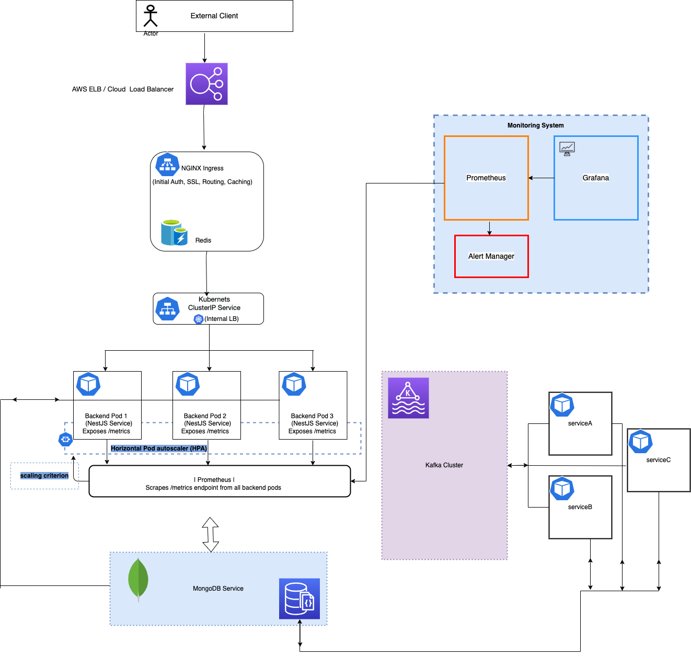

# WebService README

## Description

This service offers an API that parses a specific JSON schema and persists it in a MongoDB database. It's developed using TypeScript and [Nest.js](https://github.com/nestjs/nest).

Please note that this project serves as a demonstration and may require further refinement for production environments. Certain areas have been marked as TODO for cleanup. The primary aim was to implement a prototype.

## Table of Contents

- [Introduction](#introduction)
- [Folder Structure](#folder-structure)
- [Running the Server](#running-the-server)
  - [Running with Docker](#running-with-docker)
  - [Running Locally](#running-locally)
- [Load Balancing and Caching Strategy](#load-balancing-and-caching-strategy)
  - [Flow of Traffic](#flow-of-traffic)

## Introduction

This project showcases a scalable web service designed to handle high traffic volumes, utilizing Kubernetes for orchestration. It includes Kubernetes auto-scaling and employs advanced load balancing and caching strategies for optimal performance.

## Load Balancing and Caching Strategy

To optimize performance and reduce backend server load, the service implements a reverse proxy with an edge caching layer. This approach caches user requests before they reach the backend API endpoint, serving cached responses directly from the cache layer, as follow:

1. **Kubernetes LoadBalancer Service:**
   - Uses a Kubernetes LoadBalancer service to expose the NGINX Ingress controller externally, distributing incoming traffic to multiple backend service pods (`nestjs-service`).

2. **NGINX Ingress Caching Configuration:**
   - Configures NGINX Ingress to cache responses based on the application's caching requirements. Implements cache headers and directives (`proxy_cache`, `proxy_cache_key`, `proxy_cache_valid`, etc.).


### Flow of Traffic

1. **External Client -> Load Balancer -> NGINX Ingress Controller**
   - Routes external requests through a Load Balancer service to the NGINX Ingress controller.

2. **NGINX Ingress Controller -> Cache Check**
   - Checks if the requested resource is available in its cache.

3. **Cache Hit**
   - Serves the response directly from the cache if available.

4. **Cache Miss**
   - Forwards the request to the backend service (`nestjs-service`) if the resource is not cached.

5. **NGINX -> ClusterIP Service (`nestjs-service`) -> Backend Pod**
   - Forwards the request to the ClusterIP service of the backend.
   - Kubernetes' internal load balancer distributes the request to an available backend pod.

6. **Backend Pod -> NGINX -> Client**
   - Processes the request and returns the response to NGINX.
   - Caches the response if necessary and serves it to the client.





## Folder Structure


```
WebService
├── Dockerfile
├── README.md
├── dist
├── docker-compose.yml
├── k8s
├── node_modules
├── package.json
├── src
├── test
└── tsconfig.json
```

## Running Server

### `Running with docker`

To run the server:

```bash
 docker-compose build


 docker-compose up
```
When everything is ready, your server will be accessible via `http://localhost:3333/graphql/ `

### `Running locally`

- Install RabbitMQ
- Install Nodejs
- Install npm
- Install yarn


Follow these steps in order in the project directory:

```bash

rabbitmq-server

yarn

yarn build

yarn run start

```
